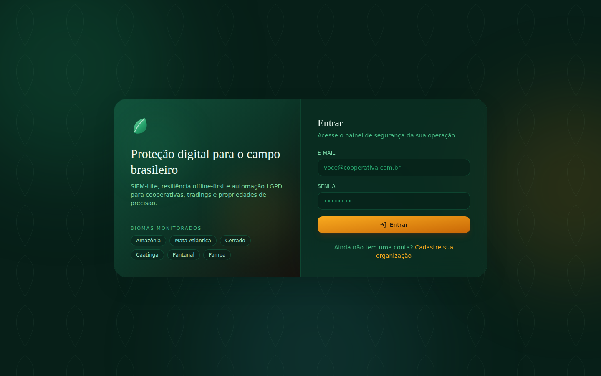
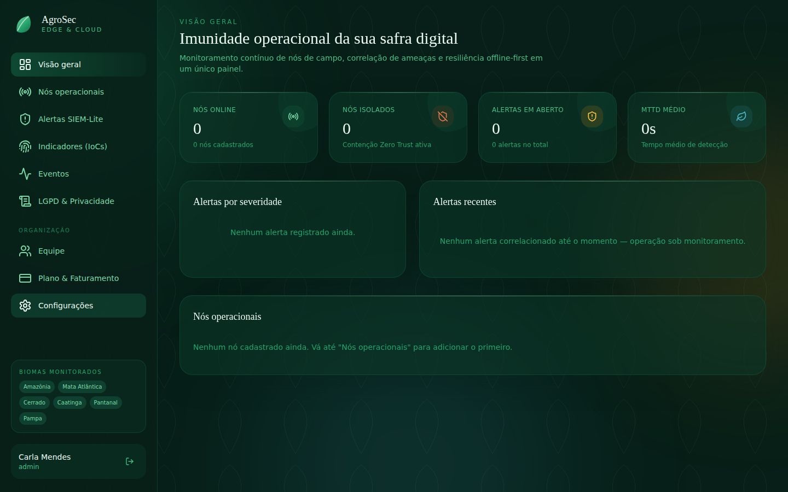
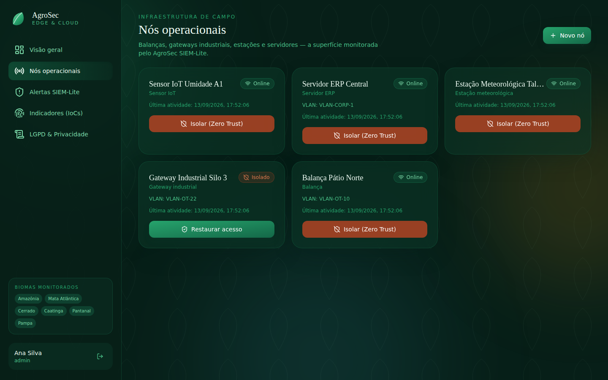
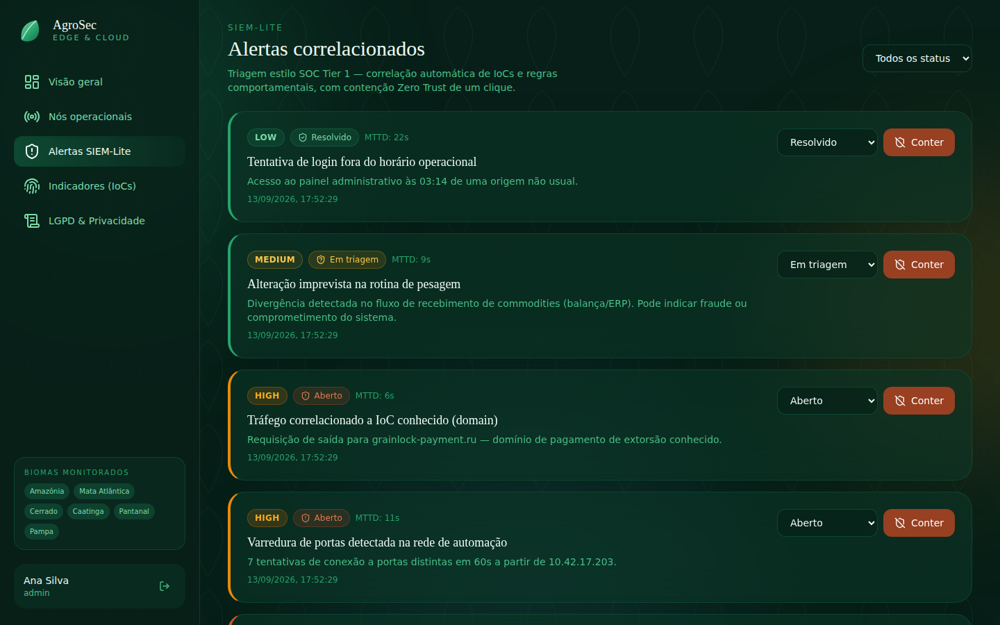
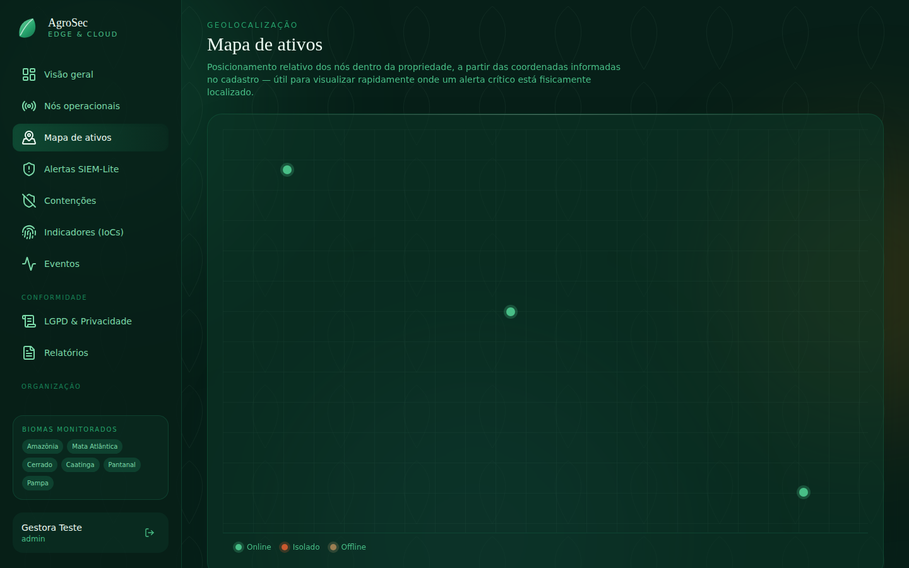
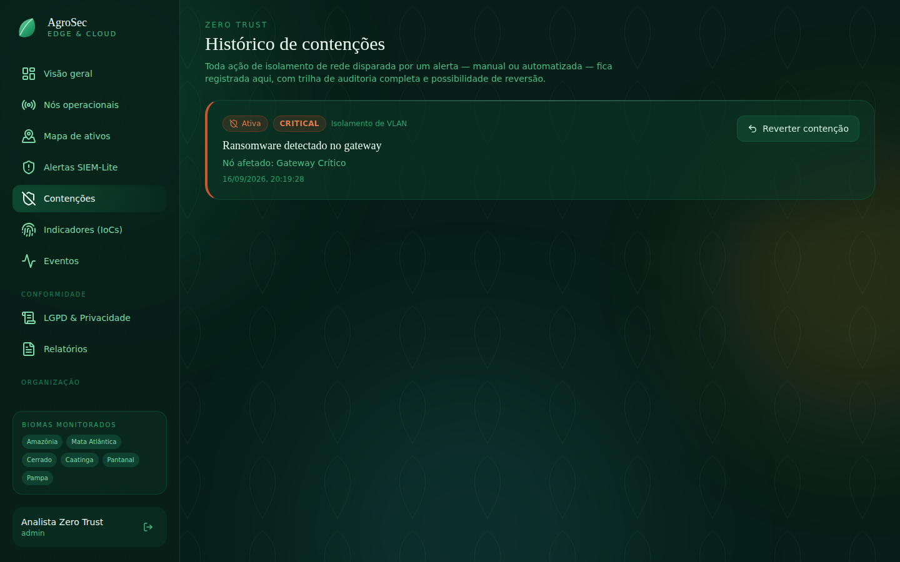
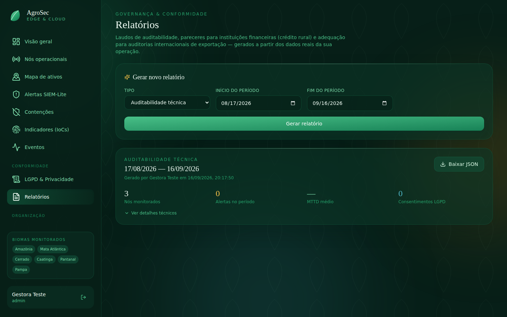
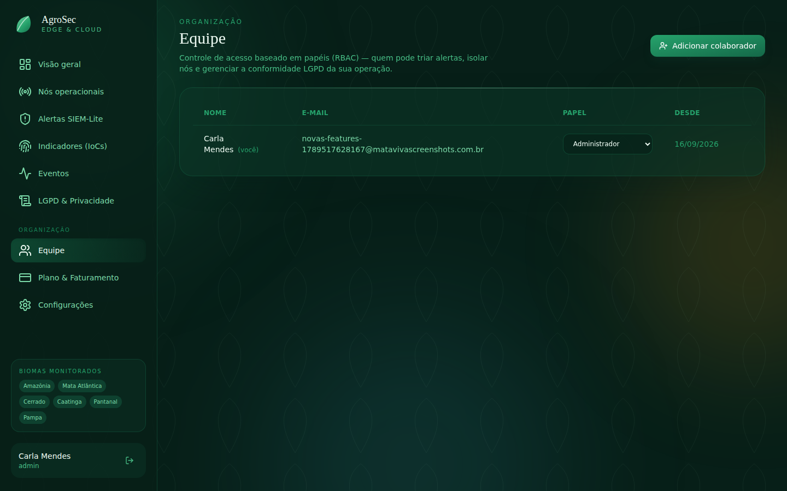
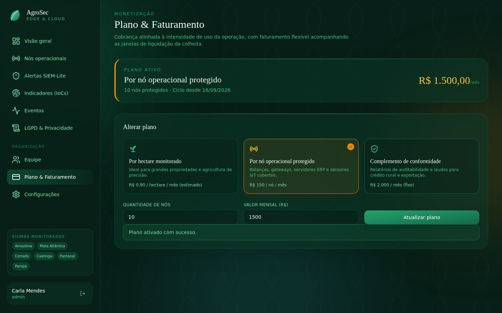
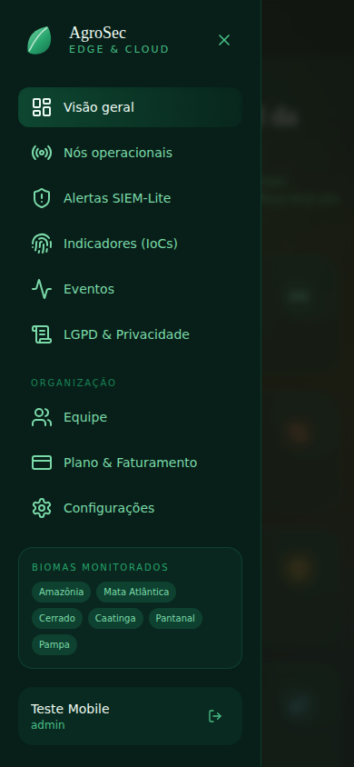

# AgroSec Edge & Cloud

Plataforma **Security-as-a-Service (SECaaS)** e de ingestão resiliente de
dados para o agronegócio, combinando monitoramento de segurança estilo SOC
(SIEM-Lite), arquitetura **offline-first** para conectividade rural
instável, e automação de conformidade com a **LGPD**.

O projeto implementa o modelo de negócio descrito em
`Pesquisa de Modelo AgTech` e usa diretamente a stack técnica do currículo
de referência: **Node.js/Express**, **Python**, **PostgreSQL**,
arquitetura **serverless orientada a eventos** (com caminho de migração
para GCP Pub/Sub + Cloud Functions), e práticas de **SOC** (SIEM,
correlação de eventos, IoCs, triagem de incidentes).

Veja `docs/ARCHITECTURE.md` para o detalhamento técnico completo e o
mapeamento entre o MVP local e a arquitetura GCP de produção.

## Capturas de tela

| | |
|---|---|
|  |  |
|  |  |
|  |  |
|  |  |
|  |  |

## Componentes

| Diretório | Papel | Stack |
|---|---|---|
| `backend/` | API core: auth, nós operacionais, eventos, alertas, sync offline, LGPD | Node.js, Express, PostgreSQL |
| `security-engine/` | Correlação de IoCs e detecção de anomalias (SIEM-Lite) | Python, FastAPI |
| `edge-gateway/` | Simulador de gateway de campo offline-first | Node.js, SQLite |
| `frontend/` | Painel web — visão geral, nós, alertas, IoCs e LGPD | React, Vite, Tailwind CSS |

## Frontend

Interface com identidade visual inspirada nos biomas brasileiros (Amazônia,
Mata Atlântica, Cerrado, Caatinga, Pantanal, Pampa): paleta verde-floresta
profunda com acentos dourados de luz solar filtrada pela copa, cartões em
vidro fosco, formas orgânicas e badges de severidade em tons de terracota
(Caatinga) e água (Pantanal).

Páginas: Login/Cadastro, Visão geral (com gráfico de alertas por
severidade), Nós operacionais (com isolamento Zero Trust de um clique),
Mapa de ativos (posiciona os nós geograficamente a partir de
latitude/longitude), Alertas SIEM-Lite (triagem e contenção), Histórico
de contenções (trilha de auditoria Zero Trust com reversão), Eventos
(log de telemetria bruta), Indicadores de comprometimento (IoCs), o
módulo LGPD completo (titulares, consentimentos, solicitações e
mapeamento de dados), Relatórios (laudos de conformidade gerados a
partir dos dados reais da operação), Equipe (RBAC — convidar
colaboradores e gerenciar papéis), Plano & Faturamento (ativação de
assinatura por hectare/nó/complemento de conformidade) e Configurações
(dados da organização e da conta). A sidebar vira um menu off-canvas com
botão hambúrguer em telas estreitas.

> ⚠️ O frontend **depende do backend já estar rodando** — ele é só a
> interface, sem o backend nenhuma tela de login/cadastro funciona (dá
> erro de "Failed to fetch"). Veja a ordem completa de setup na seção
> **[Como rodar](#como-rodar-docker-compose)** logo abaixo antes de
> executar `npm run dev`.

## Módulos funcionais (conforme a pesquisa de mercado)

- **AgroSec SIEM-Lite & Incident Correlation** — `security-engine/`
  correlaciona eventos de nós (balanças, gateways industriais, servidores
  ERP) com IoCs e regras comportamentais, reduzindo o MTTD (tempo médio
  de detecção).
- **Offline-First Secure Gateway** — `edge-gateway/` grava leituras
  localmente em SQLite e sincroniza em lotes criptografáveis quando a
  conexão é restabelecida (padrão Local-First, Sync-Later).
- **LGPD & Data Privacy Automation** — `backend/src/controllers/lgpd.controller.js`
  automatiza data mapping, gestão de consentimento, RBAC e atendimento a
  solicitações de titulares (exportação/exclusão).

## Como rodar (Docker Compose)

Requisitos: Docker e Docker Compose.

```bash
docker compose up --build
```

Isso sobe:
- `postgres` (porta 5432) com o schema já migrado automaticamente;
- `backend` (porta 3000) — API RESTful;
- `security-engine` (porta 8000) — motor de correlação, com um loop de
  polling em background e endpoints `/health`, `/stats`, `/run-cycle`;
- `frontend` (porta 5173) — painel web servido via nginx.

## Como rodar localmente sem Docker

### 1. PostgreSQL

Suba um Postgres local (ou use `docker compose up postgres`) e ajuste
`backend/.env` (copie de `.env.example`) com a `DATABASE_URL`.

### 2. Backend

```bash
cd backend
cp .env.example .env
npm install
npm run migrate
npm run dev
```

### 3. Security engine

```bash
cd security-engine
cp .env.example .env
python3 -m venv venv && source venv/bin/activate
pip install -r requirements.txt
uvicorn app:app --reload
```

### 4. Frontend

Só depois do backend (passo 2) já estar rodando e respondendo em
`http://localhost:3000/health`:

```bash
cd frontend
cp .env.example .env   # ajuste VITE_API_URL se o backend não estiver em localhost:3000
npm install
npm run dev             # http://localhost:5173
```

Abra `http://localhost:5173/register` para criar a primeira conta —
não existe usuário pré-cadastrado.

### 5. Fluxo de teste manual (curl)

```bash
# Registrar organização + usuário admin
curl -s -X POST http://localhost:3000/api/auth/register \
  -H "Content-Type: application/json" \
  -d '{"orgName":"Cooperativa Vale Verde","orgSegment":"cooperativa_trading","name":"Ana Silva","email":"ana@valeverde.com.br","password":"senha123"}'

# Guarde o "token" retornado, use como Bearer nas próximas chamadas

# Criar um nó operacional (balança)
curl -s -X POST http://localhost:3000/api/nodes \
  -H "Authorization: Bearer SEU_TOKEN" -H "Content-Type: application/json" \
  -d '{"name":"Balança Pátio 1","nodeType":"balanca","vlanSegment":"VLAN-OT-10"}'

# Cadastrar um IoC malicioso conhecido
curl -s -X POST http://localhost:3000/api/iocs \
  -H "Authorization: Bearer SEU_TOKEN" -H "Content-Type: application/json" \
  -d '{"iocType":"ip","value":"10.42.13.37","severity":"critical","description":"C2 conhecido de ransomware agro"}'

# Ingerir um evento suspeito vindo desse IP (use o node_id retornado acima)
curl -s -X POST http://localhost:3000/api/events \
  -H "Authorization: Bearer SEU_TOKEN" -H "Content-Type: application/json" \
  -d '{"nodeId":"SEU_NODE_ID","eventType":"file_mass_encryption","sourceIp":"10.42.13.37","rawPayload":{}}'

# Disparar manualmente um ciclo de correlação no security-engine
curl -s -X POST http://localhost:8000/run-cycle

# Ver o alerta gerado
curl -s http://localhost:3000/api/alerts -H "Authorization: Bearer SEU_TOKEN"
```

### 6. Edge gateway (offline-first)

```bash
cd edge-gateway
cp .env.example .env
# preencha AGROSEC_API_TOKEN (do login) e AGROSEC_NODE_ID (de um nó criado)
npm install
npm start
```

O gateway gera leituras simuladas a cada poucos segundos, grava tudo
localmente em `data/gateway.db` (SQLite) e tenta sincronizar
periodicamente — alternando entre ciclos "online" e "offline" simulados
para demonstrar a resiliência a instabilidades de rede rural.

## Resolução de problemas

**Login ou cadastro retorna "Failed to fetch"** — o navegador não
conseguiu nem alcançar o backend (não é um erro de senha/validação,
é de conectividade). Verifique nesta ordem:

1. O backend está rodando? Teste `curl http://localhost:3000/health`
   — se der erro de conexão, o backend não subiu (falta rodar o passo
   2, ou o Postgres não está acessível — confira o log do backend).
2. O frontend está apontando para o backend certo? Confira o arquivo
   `frontend/.env` — a variável `VITE_API_URL` precisa bater com onde
   o backend realmente está escutando. Se você mudou esse arquivo,
   **reinicie** `npm run dev` (o Vite só lê `.env` na inicialização).
3. Rodando via Docker Compose num servidor remoto (VM, Codespace, VPS)?
   `VITE_API_URL` é embutido no build do frontend — `http://localhost:3000`
   só funciona se o navegador estiver na mesma máquina dos containers.
   Rode `docker compose build --build-arg VITE_API_URL=http://SEU_HOST:3000 frontend`
   (ou ajuste o `args` em `docker-compose.yml`) apontando para o
   host/IP que o seu navegador realmente consegue alcançar.
4. Abra o DevTools do navegador (F12 → aba Console/Network) — uma
   mensagem de CORS ali indica origem bloqueada (o backend já libera
   qualquer origem por padrão, então isso apontaria para outro backend
   rodando na porta 3000).

## Endpoints principais da API

| Método | Rota | Descrição |
|---|---|---|
| POST | `/api/auth/register`, `/api/auth/login` | Autenticação |
| GET/POST | `/api/nodes` | Nós operacionais (balanças, gateways, sensores...) |
| POST | `/api/nodes/:id/isolate` \| `/restore` | Contenção Zero Trust manual |
| POST/GET | `/api/events` | Ingestão e consulta de eventos |
| GET/POST | `/api/iocs` | Indicadores de comprometimento |
| GET | `/api/alerts` | Alertas correlacionados |
| PATCH | `/api/alerts/:id/status` | Triagem manual (SOC Tier 1) |
| POST | `/api/alerts/:id/contain` | Contenção automatizada |
| POST | `/api/sync/batch` | Sincronização em lote (edge gateway) |
| GET/POST | `/api/lgpd/data-subjects`, `/consents`, `/requests`, `/data-mapping` | Automação LGPD |
| GET/POST | `/api/users` | Equipe (RBAC) — listar/convidar colaboradores |
| PATCH/DELETE | `/api/users/:id/role`, `/api/users/:id` | Alterar papel / remover colaborador |
| GET/POST | `/api/subscriptions/current`, `/api/subscriptions` | Plano ativo e ativação de assinatura |
| GET/PATCH | `/api/organizations/mine` | Dados da organização |
| GET/POST | `/api/reports` | Gerar e listar relatórios de conformidade (snapshot de métricas) |
| GET | `/api/containment` | Histórico de contenções Zero Trust |
| POST | `/api/containment/:id/rollback` | Reverter uma contenção (restaura o nó) |

## Alinhamento com o modelo de negócio

Este projeto foi desenhado a partir da pesquisa `Pesquisa de Modelo
AgTech`, que propõe a plataforma **AgroSec Edge & Cloud** como resposta
às vulnerabilidades do Agro 4.0: mais de 39 mil ataques cibernéticos ao
agronegócio brasileiro em 2025, ransomware de dupla extorsão explorando a
sazonalidade das safras, e exigências crescentes de conformidade com a
LGPD sobre dados de geolocalização, produtividade e crédito rural de
produtores. Os três módulos funcionais do MVP (SIEM-Lite, Offline-First
Secure Gateway, LGPD Automation) correspondem diretamente aos três
módulos descritos na proposta estratégica.
